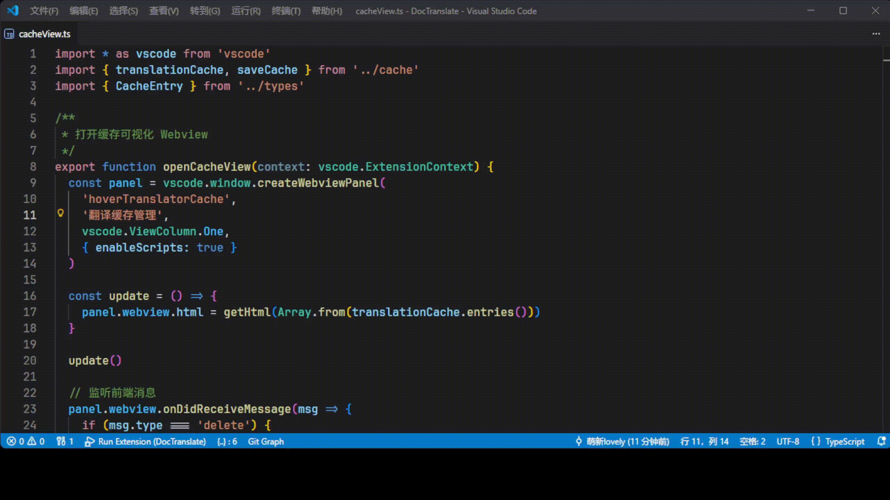

# DocTranslate

一款 VSCode 悬浮文档翻译插件，支持 AI 翻译悬停文本，可自定义翻译 API 和提示词。



## 特性

- 悬停翻译文本，支持原文/译文切换
- 缓存翻译结果，自动清理过期缓存
- 自定义 API 接口，支持阿里百炼、Moonshot 等
- 缓存管理界面，查看删除缓存内容

## 安装

1. 在 VSCode 扩展市场搜索 "DocTranslate"
2. 点击安装，或通过命令行：`ext install doctranslate.doctranslate`

## 配置

在 VSCode 设置中搜索 `hoverTranslator`，配置以下选项：

- `baseURL`: API 接口地址（默认阿里百炼）
- `apiKey`: API 密钥
- `model`: 模型名称
- `promptTemplate`: 提示词模板（含 `${content}` 占位符）
- `startupDelay`: 启动延迟时间（毫秒）

## 使用方法

1. 在文件中悬停鼠标，插件自动翻译文本
2. 点击"显示译文/原文"切换显示
3. 点击"重新翻译"更新结果
4. 使用 `Ctrl+Shift+P` 搜索"查看翻译缓存"管理缓存

## 注意事项

- 翻译需鼠标移开再悬停才会显示
- API 有流量消耗，请合理使用
- 仅支持 OpenAI 格式接口，如需其他格式需自行实现
- base_url 通常以 `/v1` 结尾

## 项目结构

```
src/
├── extension.ts        # 插件入口点
├── hoverProvider.ts    # 悬浮提供者
├── translation.ts      # 翻译核心逻辑
├── cache.ts           # 缓存管理
├── commands.ts        # 命令定义
├── types.ts           # 类型定义
├── utils.ts           # 工具函数
└── views/
    └── cacheView.ts   # 缓存查看界面
```

## 二次开发

1. 克隆仓库：`git clone https://github.com/nihaozyj7/DocTranslate`
2. 安装依赖：`pnpm install`
3. 编译：`pnpm run compile`
4. 调试：按 F5 启动新窗口测试

## 许可证

MIT License
